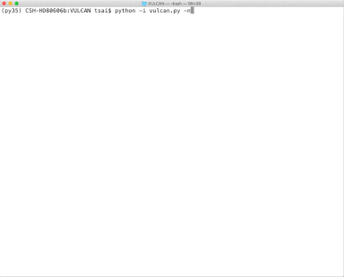

# VULCAN

Photochemical kinetics for exoplanetary atmospheres, a fast and easy-to-use python code.  This distribution of VULCAN contains a number of performance and usability improvements.

[](https://www.gnu.org/licenses/gpl-3.0)
<a href="https://github.com/FormingWorlds/VULCAN/actions/workflows/tests.yaml">
    
</a>


More information can be found on the [documentation](https://proteus-framework.org/VULCAN/) pages:

* [installation guide](https://proteus-framework.org/VULCAN/How-to/installation.html)
* [usage guide](https://proteus-framework.org/VULCAN/How-to/index.html)
* [contributing guide](https://proteus-framework.org/VULCAN/Community/CONTRIBUTING.html)


The theory papers of VULCAN can be found here:

* [Tsai et al. 2021](https://arxiv.org/abs/2108.01790) (with photochemistry)
* [Tsai et al. 2017](https://arxiv.org/abs/1607.00409) (without photochemistry).




## Quick Demo

Let's dive in and see chemical kinetics in action!

First, go to the `fastchem_vulcan/` folder to compile FastChem by running
```
make
```

After compilation has finished, go back to the main directory of VULCAN and run
```
python vulcan.py
```

You should see the default model starts running with real-time plotting.
This will take about 10-15 minutes to complete depending on your comuputer.

Now you may want to try a different T-P input, changing the elemental abundances or
vertical mixing. All these settings are set in ```config.py```. For example, find and edit
```python
const_Kzz = 1.E7
```
and
```python
C_H = 6.0618E-4
```
for a weaker vertical mixing (K<sub>zz</sub>) and carbon rich (C/O=1) run. Set use_live_plot = False if you wish to switch off the real-time plotting (why whould you though?). More detailed instruction can be found in the following sections. Have fun!

The object in this `config.py` file can be edited at runtime and passed around as a variable.

## Reading Output Files
Run ```plot_vulcan.py``` within ```plot_py```
```
python plot_vulcan.py [vulcan output] [species] [plot name] [-h (for plotting height)]
```
will read vulcan output (.vul files) can plot the species profiles. Species should be sepreated by commas without space. Plot is in pressure by diffcult and can be changed to height by adding "-h".

