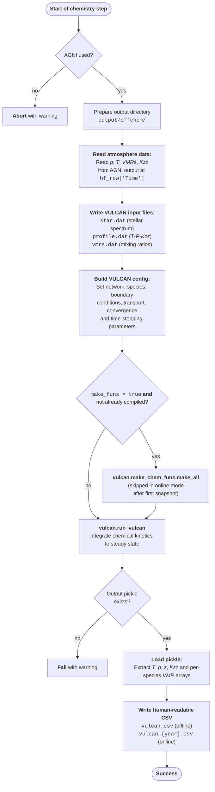

# VULCAN in PROTEUS

VULCAN serves as the atmospheric chemistry module within the
[PROTEUS framework](https://proteus-framework.org/PROTEUS), computing steady-state
photochemical and thermochemical mixing-ratio profiles from the temperature–pressure
structure produced by AGNI at each chemistry step. This page describes the data flow
between PROTEUS and VULCAN: what inputs are prepared, how VULCAN is configured and
invoked, and how the results are stored and passed back.

The source code for this coupling lives in the
[vulcan dispatcher](https://github.com/FormingWorlds/PROTEUS/blob/main/src/proteus/atmos_chem/vulcan.py)
(`run_vulcan`) and the outer
[chemistry wrapper](https://github.com/FormingWorlds/PROTEUS/blob/main/src/proteus/atmos_chem/wrapper.py)
(`run_chemistry`) inside PROTEUS. A description and
[flowchart](https://proteus-framework.org/PROTEUS/Explanations/code_architecture.html#architecture-diagram)
of the broader PROTEUS architecture can be found
[here](https://proteus-framework.org/PROTEUS/Explanations/code_architecture.html).

!!! info "Scheduling modes"
    VULCAN is called according to `config.atmos_chem.when`:

    - **`'offline'`**: runs once as a post-processing step after the main PROTEUS loop,
      using the final atmospheric state.
    - **`'online'`**: runs at every data-write snapshot during the main simulation loop,
      producing one output file per snapshot.
    - **`'manually'`**: chemistry is skipped entirely; the user manages when to run it.

    The flowchart below describes `run_vulcan` directly and applies to both offline and
    online modes; differences are noted where they arise.

!!! warning "AGNI-only support"
    VULCAN chemistry is only supported when `atmos_clim.module = "agni"`. Using any
    other climate module causes `run_vulcan` to log a warning and return `False` without
    running.

---

## Step-by-step flow

The following flowchart describes each chemistry run in PROTEUS step-by-step. The source code for this diagram can be found in the [VULCAN dispatcher](https://github.com/FormingWorlds/PROTEUS/blob/main/src/proteus/atmos_chem/vulcan.py) in PROTEUS.  

---

## Inputs read from PROTEUS

!!! warning "Unit conventions"
    VULCAN uses CGS units internally. The dispatcher converts pressures (Pa → dyne cm$^{-2}$,
    $\times$10), altitudes (m → cm, $\times$ 100), and eddy diffusivities (m$^{2}$ s$^{-1}$ → cm$^{2}$ s$^{-1}$, $\times$ 10$^{4}$)
    on the way in, and reverses those conversions when parsing the output pickle.

At each call, the dispatcher reads the current atmospheric state produced by AGNI via
`read_atmosphere_data`, requesting the following keys:

| Key | Description | Treatment |
|---|---|---|
| `pl` | Pressure at level edges (Pa) |$\times$10 → dyne cm$^{-2}$ |
| `tmpl` | Temperature at level edges (K) | Clipped to ≥ 180 K |
| `Kzz` | Eddy diffusivity profile (m$^{2}$ s$^{-1}$) | $\times$10$^{4}$ → cm$^{2}$ s$^{-1}$ |
| `{gas}_vmr` | Per-species VMR profile | Written directly to `vmrs.dat` |

!!! info "VMRs"
    VMRs are stored as individual `{gas}_vmr` keys (e.g. `H2O_vmr`, `CH4_vmr`) that
    are iterated when writing `vmrs.dat`. The `x_gas` entry in `extra_keys` requests
    this family of keys from PROTEUS.

The stellar spectrum is read from the nearest-year `.sflux` file in `output/data/`
and scaled from the planet's orbital distance to the stellar surface
($\times$`separation^2 / R_star^2`) before being clipped and written to `star.dat`. VULCAN
then re-scales it internally from the stellar surface to the orbital distance.

---

## PROTEUS → VULCAN configuration

The dispatcher translates several PROTEUS config attributes into VULCAN config
attributes. The key mappings are:

| PROTEUS config | Effect on VULCAN config |
|---|---|
| `atmos_chem.vulcan.network` | Selects network file and `atom_list` (see table below) |
| `atmos_chem.photo_on` | `vcfg.use_photo`; also selects photo vs thermo network for CHO/NCHO |
| `atmos_chem.vulcan.ini_mix = 'profile'` | `vcfg.ini_mix = 'table'` (reads from `vmrs.dat`) |
| `atmos_chem.vulcan.ini_mix` (other) | `vcfg.ini_mix = 'const_mix'` |
| `atmos_chem.vulcan.fix_surf = True` | `vcfg.use_fix_sp_bot = const_mix` (surface VMRs held fixed) |
| `atmos_chem.vulcan.fix_surf = False` | `vcfg.use_fix_sp_bot = {}` (free lower boundary) |
| `atmos_chem.Kzz_const` (not None) | `vcfg.Kzz_prof = 'const'`; `vcfg.const_Kzz = Kzz_const` |
| `atmos_chem.Kzz_const = None` | `vcfg.Kzz_prof = 'file'` (reads from `profile.dat`) |
| `atmos_chem.moldiff_on` | `vcfg.use_moldiff` |
| `atmos_chem.updraft_const` | `vcfg.const_vz` |
| `orbit.zenith_angle` | `vcfg.sl_angle` (converted to radians) |
| `orbit.s0_factor` | `vcfg.f_diurnal` |
| `atmos_chem.vulcan.yconv_cri` | `vcfg.yconv_cri` |
| `atmos_chem.vulcan.slope_cri` | `vcfg.slope_cri` |

The background gas (`vcfg.atm_base`) is chosen automatically as the most abundant of
H$_2$, N$_2$, O$_2$, and CO$_2$ in the current atmosphere.

### Network options

| `config.atmos_chem.vulcan.network` | Network file | Elements |
|---|---|---|
| `'CHO'` | `CHO_photo_network.txt` or `CHO_thermo_network.txt` | H, O, C |
| `'NCHO'` | `NCHO_photo_network.txt` or `NCHO_thermo_network.txt` | H, O, C, N |
| `'SNCHO'` | `SNCHO_photo_network.txt` (always) | H, O, C, N, S |

---

## Output files

All files are written to `output/offchem/`.

| File | Mode | Contents |
|---|---|---|
| `vulcan.pkl` | offline | Full VULCAN result object (binary pickle) |
| `vulcan.csv` | offline | T, p, z, Kzz, and per-species VMRs (human-readable) |
| `vulcan_{year}.pkl` | online | Per-snapshot pickle (year = integer simulation year) |
| `vulcan_{year}.csv` | online | Per-snapshot CSV |

### CSV column order

Columns appear in this order: `tmp`, `p`, `z`, `Kzz`, then one column per chemical
species (excluding any species whose name contains `_`, i.e. condensates). Arrays are
flipped to surface-first ordering to match AGNI's convention.

| Column | Units | Source in pickle |
|---|---|---|
| `tmp` | K | `result['atm']['Tco']` |
| `p` | Pa | `result['atm']['pco']` ÷ 10 |
| `z` | m | `result['atm']['zco'][:-1]` ÷ 100 |
| `Kzz` | cm$^{2}$ s$^{-1}$ | `result['atm']['Kzz']`, prepended with surface value |
| `{species}` | VMR | `result['variable']['ymix'][:, i]` for each gas |

---

## Online vs offline: key differences

| | Offline (`when = "offline"`) | Online (`when = "online"`) |
|---|---|---|
| When called | Once, after the main loop exits | At every data-write snapshot |
| Output directory | Wiped and recreated each call | Created once; reused across snapshots |
| Output filenames | `vulcan.pkl`, `vulcan.csv` | `vulcan_{year}.pkl`, `vulcan_{year}.csv` |
| Network compilation | Runs if `make_funs = True` | Runs on first snapshot only (tracked via function attribute `_made`) |

