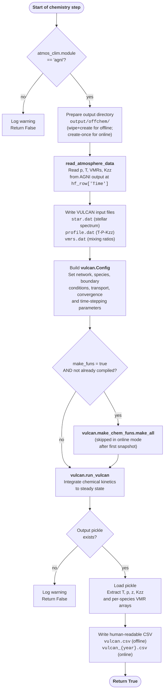

# VULCAN in PROTEUS

This page describes how VULCAN is wired into the PROTEUS framework as its atmospheric chemistry module. The source code for this coupling can be found in the [vulcan dispatcher](https://github.com/FormingWorlds/PROTEUS/blob/main/src/proteus/atmos_chem/vulcan.py) and the [chemistry wrapper](https://github.com/FormingWorlds/PROTEUS/blob/main/src/proteus/atmos_chem/wrapper.py) inside the PROTEUS source code. A description and [flowchart](https://proteus-framework.org/PROTEUS/Explanations/code_architecture.html#architecture-diagram) of the PROTEUS code architecture can be found [here](https://proteus-framework.org/PROTEUS/Explanations/code_architecture.html).

---

## At each PROTEUS chemistry step

---

## Input data read from PROTEUS

At each call, `run_vulcan` reads the current atmospheric state produced by AGNI via `read_atmosphere_data`, requesting the following keys:

| Key | Description | Unit conversion applied |
|---|---|---|
| `pl` | Pressure at level edges | Pa → dyne cm⁻² (×10) |
| `tmpl` | Temperature at level edges | Clipped to ≥ 180 K |
| `x_gas` | Per-species VMR profiles | Written directly |
| `Kzz` | Eddy diffusivity profile | m² s⁻¹ → cm² s⁻¹ (×10⁴) |

The stellar spectrum is taken from the nearest-year `.sflux` file in `output/data/`, then scaled from the planet's orbital distance to the stellar surface before being clipped and written to `star.dat`.

---

## Output files written by VULCAN

| Filename | Mode | Description |
|---|---|---|
| `vulcan.pkl` | offline | Binary pickle of the full VULCAN result object |
| `vulcan.csv` | offline | Human-readable CSV of T, p, z, Kzz, and per-species VMRs |
| `vulcan_{year}.pkl` | online | Per-snapshot pickle (year = integer simulation year) |
| `vulcan_{year}.csv` | online | Per-snapshot CSV |

All files are written to `output/offchem/`. The CSV columns are (in order): `tmp`, `p`, `z`, `Kzz`, followed by one column per chemical species (excluding species whose names contain `_`). Arrays are flipped to match AGNI's surface-first ordering.

---

## Fields in the output CSV

| Column | Units | Source |
|---|---|---|
| `tmp` | K | `result['atm']['Tco']` |
| `p` | Pa | `result['atm']['pco']` ÷ 10 |
| `z` | m | `result['atm']['zco'][:-1]` ÷ 100 |
| `Kzz` | cm² s⁻¹ | `result['atm']['Kzz']`, prepended with surface value |
| `{species}` | VMR | `result['variable']['ymix'][:, i]` for each gas without `_` in its name |

---

## Online vs offline mode summary

| Behaviour | Offline (`when = "offline"`) | Online (`when = "online"`) |
|---|---|---|
| When called | Once, after the main loop exits | Every data-write snapshot in the main loop |
| Output directory | Wiped and recreated each call | Created once; reused across snapshots |
| Output filenames | `vulcan.pkl`, `vulcan.csv` | `vulcan_{year}.pkl`, `vulcan_{year}.csv` |
| Network compilation | Always runs if `make_funs = true` | Runs only on the first snapshot; skipped thereafter |
| Skipped if desiccated | No (desiccation is checked before calling) | Yes (`is_snapshot and not self.desiccated`) |

---

## Caveats

!!! warning "AGNI-only support"
    VULCAN chemistry is only supported when `atmos_clim.module = "agni"`. Using `"janus"` or `"dummy"` causes `run_vulcan` to log a warning and return `False` without running.

!!! warning "Unit conventions at the wrapper boundary"
    VULCAN uses CGS units internally. The wrapper converts pressures (Pa → dyne cm⁻²), altitudes (m → cm), and eddy diffusivities (m² s⁻¹ → cm² s⁻¹) before writing input files, and reverses the conversions when parsing the output pickle.

!!! warning "SNCHO requires photochemistry network"
    The `"SNCHO"` network always loads `SNCHO_photo_network.txt` regardless of the `photo_on` flag. If photochemistry is not desired for sulfur runs, use `"NCHO"` instead.