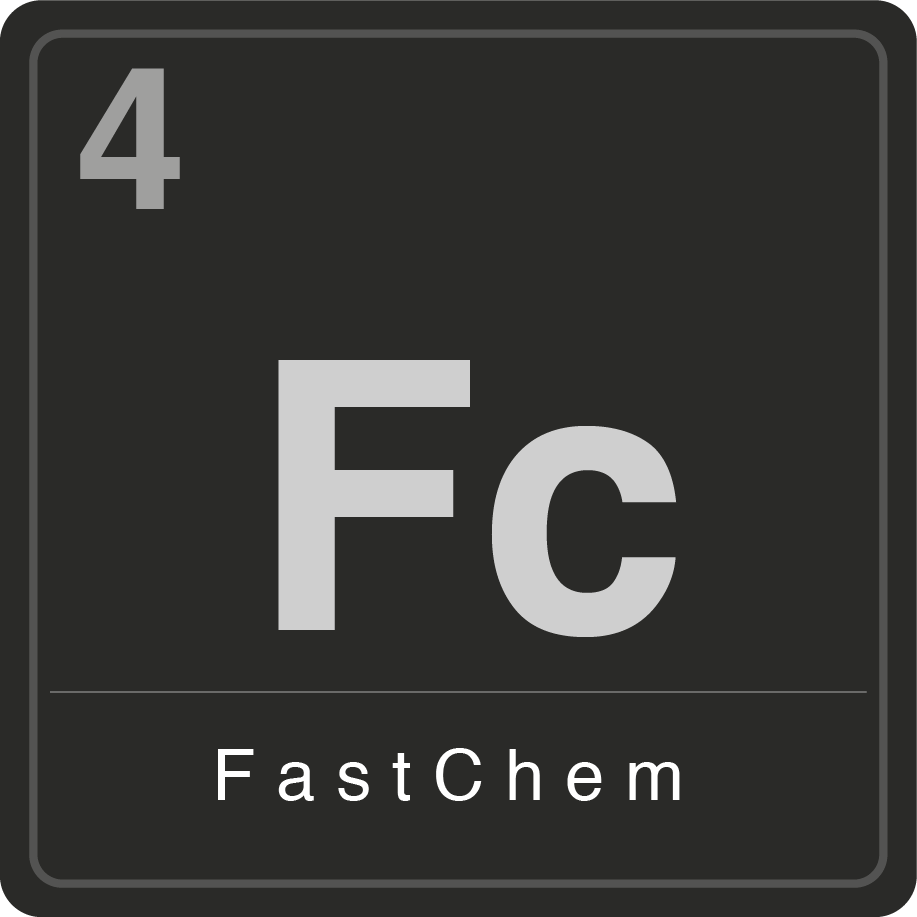

<div style="display: flex; align-items: center; gap: 2rem; margin-bottom: 1.5rem;">
  
  <div>
    <h1>FastChem</h1>
    <p>
      VULCAN uses <a href="https://github.com/NewStrangeWorlds/FastChem">FastChem</a>
      to set up the initial chemical composition of the atmosphere before the
      kinetics calculation begins. This page gives a short overview of what
      FastChem is, how it works, and how it is integrated into VULCAN.
    </p>
  </div>
</div>

!!! info "PROTEUS fork"
    A separate fork of FastChem, used elsewhere in the PROTEUS framework (e.g. by AGNI), is maintained at [FormingWorlds/FastChem](https://github.com/FormingWorlds/FastChem).
    VULCAN currently relies on its own embedded copy of FastChem, adapted from FastChem 2.0, rather than this fork. VULCAN may switch to the PROTEUS fork in a future release.


## What is FastChem?

FastChem is an **open-source equilibrium chemistry code** developed by
Daniel Kitzmann, Joachim W. Stock and collaborators. It computes the chemical equilibrium composition of a gas given a temperature, a pressure, and a set of elemental abundances. 

Rather than performing a direct Gibbs free energy minimisation, FastChem
solves the coupled system of equations formed by the **law of mass action**
for every molecule/ion together with the **element conservation equations**. This system is decomposed into a series of one-dimensional non-linear equations which are solved analytically wherever possible and iterated until the whole system converges. This semi-analytical approach makes FastChem fast and numerically robust, even at the low temperatures and high pressures typical of rocky-planet atmospheres.

FastChem is written in object-oriented C++, with a Python wrapper
(`pyFastChem`) for scripting, and is released under the **GNU General Public
License v3.0**.

### Versions

FastChem has been developed through several major versions, each documented
in its own paper:

- **FastChem 1** ([Stock et al. 2018](https://doi.org/10.1093/mnras/sty1531)): the original release, solving the gas-phase equilibrium for neutral and ionised species. It required hydrogen to be present as a reference element.
- **FastChem 2** ([Stock et al. 2022](https://doi.org/10.1093/mnras/stac2623)): generalised the formalism so that it no longer relies on hydrogen as a reference element, allowing it to be applied to arbitrary (even hydrogen-free) element mixtures. This version also introduced the `pyFastChem` Python interface, distributed via PyPI.
- **FastChem Cond** ([Kitzmann, Stock & Patzer 2024](https://doi.org/10.1093/mnras/stad3515)): added equilibrium condensation and a rainout approximation, together with thermochemical data for roughly 290 condensate species, enabling cloud-relevant chemistry for cool planets and brown dwarfs.
- **FastChem 4** ([Kitzmann, Stock & Patzer 2026](https://arxiv.org/abs/2605.18264)): a major update focused on robustness and coverage. The thermochemical database is expanded to 800 gas-phase molecules/ions and 511 condensates across 44 elements, adding rare-earth, transition, and heavy elements such as Sc, Y, Ba, and Li. 

## How VULCAN uses FastChem

VULCAN ships with its own bundled, modified copy of FastChem in the
[`fastchem_vulcan/`](https://github.com/FormingWorlds/VULCAN/tree/main/fastchem_vulcan)
directory. This version is based on the FastChem 2.0 formalism (arbitrary
element compositions), but has been adapted so that its
equilibrium constants are computed from the same **NASA-9 polynomial**
thermochemical data that VULCAN itself uses for the chemical kinetics
network. This keeps the equilibrium initial state and the kinetics network
thermodynamically consistent with one another.

Before running VULCAN for the first time, this bundled copy of FastChem must
be compiled with a C++ compiler:

```bash
cd fastchem_vulcan/
make
```

### Relevant configuration options

| `config.py` option | Description |
| --- | --- |
| `ini_mix = 'eq'` | Use FastChem to compute the initial composition (default). Other options (`const_mix`, `vulcan_ini`, `table`) bypass FastChem entirely. |
| `use_solar` | If `True`, use solar elemental abundances (Lodders 2009) as-is. If `False`, use the custom abundances below. |
| `O_H`, `C_H`, `N_H`, `S_H`, `He_H`, ... | Elemental abundance ratios (relative to H) for the elements in `atom_list`, used when `use_solar = False`. |
| `fastchem_met_scale` | Scaling factor applied to the solar abundances of elements known to FastChem but not tracked by the VULCAN network (e.g. Si, Mg, Ti). A value of `0.1` gives these elements 0.1x solar abundance. |
| `use_ion` | Whether ionised species are included in the equilibrium calculation (selects `parameters_ion.dat` vs `parameters_wo_ion.dat`). |
| `atom_list` | The set of elements tracked by the active chemical network; determines which elemental abundances are passed through to FastChem individually. |

## Acknowledgements and citation

If you use VULCAN, please also acknowledge FastChem. Depending on which aspects of FastChem are relevant to your work, cite some or all of the papers listed on the [publications page](Reference/bibliography.md).

The FastChem source code is hosted at
[github.com/NewStrangeWorlds/FastChem](https://github.com/NewStrangeWorlds/FastChem) and is
released under the GNU General Public License v3.0, the same licence used by
VULCAN.
